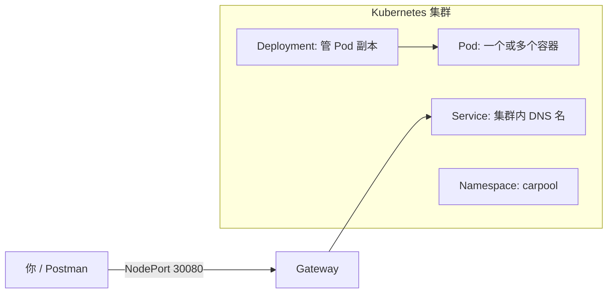

# Kubernetes 部署教程（Windows）

本教程帮你在 Windows 上把拼车 Demo 部署到 Kubernetes。推荐用 **Docker Desktop 自带 K8s**，上手最快。

---

## 一、需要下载什么

| 软件 | 用途 | 下载 |
|------|------|------|
| **Docker Desktop** | 构建镜像 + 运行 K8s | https://www.docker.com/products/docker-desktop/ |
| **kubectl** | 操作 K8s 集群（Docker Desktop 一般会自带） | https://kubernetes.io/docs/tasks/tools/ |
| **Maven + JDK 21** | 本地编译（构建镜像前） | 你已有 |

可选：

| 软件 | 何时需要 |
|------|----------|
| **minikube** | 不想用 Docker Desktop K8s 时 | https://minikube.sigs.k8s.io/docs/start/ |
| **Lens** | 图形化看 Pod/日志 | https://k8slens.dev/ |

---

## 二、启用 Kubernetes（Docker Desktop）

1. 安装并启动 **Docker Desktop**
2. 设置 → **Kubernetes** → 勾选 **Enable Kubernetes**
3. 点击 **Apply & Restart**，等待左下角 Kubernetes 变绿
4. 打开 PowerShell 验证：

```powershell
kubectl version --client
kubectl get nodes
```

应能看到一个 `Ready` 的节点（`docker-desktop`）。

---

## 三、核心概念（5 分钟看懂）



| 资源 | 是什么 | 本项目例子 |
|------|--------|------------|
| **Namespace** | 逻辑隔离 | `carpool` |
| **Deployment** | 声明要跑几个副本、用什么镜像 | `gateway`、`trip-service` |
| **Service** | 给 Pod 一个稳定名字 | `mysql`、`nacos`、`gateway` |
| **NodePort** | 从宿主机访问服务 | Gateway `30080`，trip WS `30081` |
| **Secret** | 敏感配置 | 高德 API Key |

---

## 四、部署步骤

### 1. 本地初始化数据库（推荐）

在宿主机 MySQL 执行完整脚本（比 K8s 内嵌 init 更稳）：

```powershell
mysql -uroot -p < d:\wff\demo\deploy\sql\schema.sql
```

若坚持用 K8s 内 MySQL，部署后进入 Pod 手动导入 `schema.sql`。

### 2. 构建 Docker 镜像

```powershell
cd d:\wff\demo
.\deploy\docker\build-images.ps1
```

会为 5 个服务生成 `carpool/gateway:latest` 等镜像。

### 3. 创建命名空间与基础设施

```powershell
kubectl apply -f deploy/k8s/00-namespace.yaml
kubectl apply -f deploy/k8s/infra/mysql.yaml
kubectl apply -f deploy/k8s/infra/redis.yaml
kubectl apply -f deploy/k8s/infra/nacos.yaml
kubectl get pods -n carpool -w
```

等 `mysql`、`redis`、`nacos` 都是 `Running`。

### 3.1 初始化 Seata 数据库

```powershell
cmd /c "kubectl exec -i -n carpool deploy/mysql -- mysql -uroot -p<MYSQL_ROOT_PASSWORD> < d:\wff\demo\deploy\sql\seata.sql"
```

### 3.2 部署 Seata Server

```powershell
docker pull apache/seata-server:2.5.0
# 若 Pod 拉镜像失败，先导入 kind 节点（与 mysql 同理）:
# docker save apache/seata-server:2.5.0 -o $env:TEMP\seata.tar
# docker cp $env:TEMP\seata.tar desktop-control-plane:/tmp/import.tar
# docker exec desktop-control-plane ctr -n k8s.io images import /tmp/import.tar

kubectl apply -f deploy/k8s/infra/seata.yaml
kubectl get pods -n carpool -w
```

等 `seata-server` 为 `Running` 后再继续。

### 4. 发布 Nacos 配置（K8s 版，MySQL/Redis 用集群 DNS）

```powershell
kubectl port-forward -n carpool svc/nacos 8848:8848
```

另开一个终端：

```powershell
cd d:\wff\demo
.\deploy\k8s\publish-nacos-k8s.ps1
```

> `deploy/nacos/k8s/*.yml` 里数据库 host 是 `mysql`，Redis 是 `redis`，不是 `127.0.0.1`。

### 5. 部署微服务

```powershell
kubectl apply -f deploy/k8s/apps/microservices.yaml
kubectl get pods -n carpool
```

### 6. 访问

| 入口 | 地址 |
|------|------|
| Gateway API | http://localhost:30080 |
| 司机 WebSocket | ws://localhost:30081/ws/driver/trips |
| SkyWalking UI | http://localhost:8088（需 `kubectl port-forward -n carpool svc/skywalking-ui 8088:8080`） |
| Nacos 控制台 | http://localhost:8848/nacos（port-forward 时） |

测试管理员登录：

```http
POST http://localhost:30080/api/admin/auth/login?username=admin&password=admin123
```

---

## 五、日常重启（关机后再开）

MySQL 已配置 **PVC 持久化**（`mysql-data` 2Gi），`schema.sql` 已包含各库的 **undo_log** 表，正常关机后数据应保留。

### 最简流程（2 步）

1. 启动 **Docker Desktop**，等 Kubernetes Ready
2. 开一个 PowerShell，保持运行：

```powershell
kubectl port-forward -n carpool svc/gateway 30080:8080
```

Postman 使用 `http://127.0.0.1:30080`。

### 若微服务 CrashLoopBackOff

先检查 Pod：

```powershell
kubectl get pods -n carpool
```

若 `driver-service` / `passenger-service` / `trip-service` 异常，一键恢复数据库：

```powershell
cd d:\wff\demo
.\deploy\k8s\restore-db.ps1
```

等 30 秒后再 `kubectl get pods -n carpool`，确认全部 `Running`。

### 首次启用 MySQL 持久化

若从旧版（无 PVC）升级，需重新 apply 并导入一次：

```powershell
kubectl apply -f deploy/k8s/infra/mysql.yaml
.\deploy\k8s\restore-db.ps1
```

---

## 六、常用 kubectl 命令

```powershell
# 看 Pod
kubectl get pods -n carpool

# 看某个 Pod 日志
kubectl logs -n carpool deploy/trip-service -f

# 进容器调试
kubectl exec -it -n carpool deploy/mysql -- bash

# 删除整个环境重来
kubectl delete namespace carpool
```

---

## 七、故障排查

| 现象 | 可能原因 | 处理 |
|------|----------|------|
| Pod `ImagePullBackOff` | 镜像没构建 | 运行 `build-images.ps1` |
| 微服务 `CrashLoopBackOff` | MySQL 数据丢失 / 缺 undo_log | 运行 `restore-db.ps1` |
| 服务启动连不上 Nacos | Nacos 未 Ready | `kubectl get pods -n carpool` 等 nacos Running |
| 数据库连接失败 | schema 未导入 / 用了本地版 nacos 配置 | 用 `publish-nacos-k8s.ps1` 或 `restore-db.ps1` |
| Gateway 404 | Nacos 路由未发布 | 重新 publish gateway.yml |
| Seata 报错 | 未部署 Seata / seata 库未建 / Nacos 配置仍是 127.0.0.1 | 按 3.1–3.2 部署 Seata，重新 `publish-nacos-k8s.ps1`，重启微服务 |

---

## 八、与本地开发的区别

| 项 | 本地 IDEA | Kubernetes |
|----|-----------|------------|
| Nacos 地址 | 127.0.0.1:8848 | nacos:8848 |
| MySQL | 127.0.0.1:3306 | mysql:3306 |
| Redis | 127.0.0.1:6379 | redis:6379 |
| Kafka | 127.0.0.1:9092（port-forward） | kafka:9092 |
| 对外入口 | localhost:8080 | NodePort 30080 |

---

## 九、文件清单

```
deploy/k8s/
  00-namespace.yaml      # 命名空间
  infra/                 # MySQL / Redis / Nacos / Seata / SkyWalking / Kafka
  apps/microservices.yaml # 5 个业务服务
  publish-nacos-k8s.ps1  # 发布 K8s 版 Nacos 配置
deploy/docker/
  Dockerfile             # 多阶段构建
  build-images.ps1       # 一键构建镜像
deploy/nacos/k8s/        # K8s 专用服务配置
```
